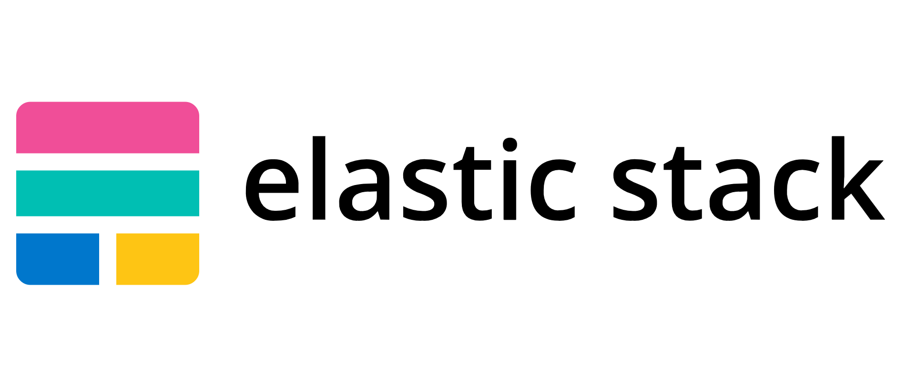
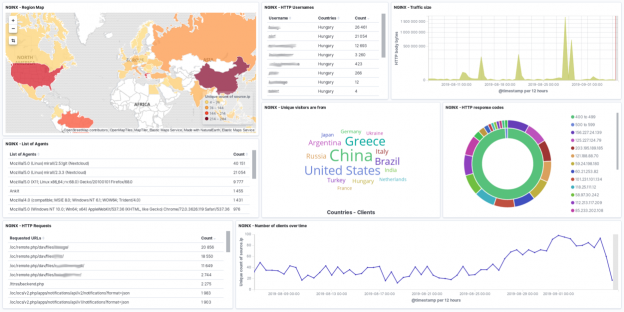

# **ELK-Project-Demo**
 
Elastic (ELK) Stack Demonstration

*By Nathaniel Ones*
 
# **Background & Purpose** #
This ELK demonstartion was created to showcase the security monitoring capabilities and tools of an ELK stack on a virtual cloud environment and how it can be implemented by network engineers. Using our ELK stack, we are able to monitor all incoming and outgoing traffic to our environment, save data logs, identify possible security breaches, and visualize threats in real time. This allows us to more efficiently protect our cloud environment and create an automated security monitoring system that will run 24/7.

# **Project Scope** #
This ELK Stack project was deployed in a Microsoft Azure Cloud environment. This ELK Stack also focuses on two popular beat-types: Filebeat (file system data) and Metricbeat (machine metrics) for a DVWA application on the virtual network.
  
# **Implementation** #

## Virtual Network Creation ##

1. Create a virtual network with a network IP range 10.1.0.0/16.
2. Create a default subnet with an IP range 10.1.0.0/24.
3. Add a "peer connection" between our ELK virtual network (ELK-NET) and the virtual network we want to monitor (RedTeamNet) which will allow us to seamlessly connect multiple networks and share traffic data amongst those networks.

## Virtual Machine Creation ## 
1. Create our ELK virtual machine within an Ansible container on our virtual network.
2. Add our ELK virtual machine to our Ansible "hosts" file.
3. Configure our virtual machine using "Docker" by creating an Ansible playbook, then prepare to launch our newly configured ELK virtual machine.

## Establish a Network Security Group ##

Using Azure, create a network security group that by default blocks all traffic to protect the virtaul environment as it is being built out. The NSG is subsequently modified to allow specific traffic as the infrastructure is expanded by editing inbound security rules. 

1. Enable an inbound security rule to allow SSH connections via Port 22 from our local workstation IP address only, limiting access to the virtual environment to the project engineer only.
2. Enable an inbound security rule to allow TCP traffic for our ur ELK web server that is running on Port 5601.

## Specify Our Security Monitoring using "Beats" ##
ELK officially offers eight beat-types for engineers to choose that will help them track specific data in the environment. In this demonstration, we will exhibit Filebeat and Metricbeat.

Filebeat - will help us generate and organize log files to send to Logstash and Elasticsearch.

Metricbeat - will help us collect system and service statistics such as CPU and memory.

1. Navigate to our DVWA containers and install Filebeat & Metricbeat by creating a configuration playbook.
2. Launch the Kibana web application to verify that our system tools have been updated accordingly.

## Launch the "Kibana" Web Application ##
Using the public IP address of our ELK stack virtual machine, we can access the Kibana webpage which will help us visualize our security posture of our virtual environment using graphs, charts, and complex dashboards.

Using the many security tools provided by ELK stack, we are now ready to efficiently and effectively monitor the security of our cloud network environment with detailed precision!

  
____________________________________________________

*For more information about ELK stack, please visit their website:*
[elastic.co](https://www.elastic.co/what-is/elk-stack)
